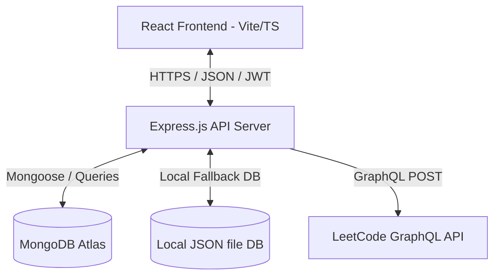

# LeetVision AI — LeetCode Analytics OS

LeetVision AI is a production-ready, full-stack analytical platform that synchronizes with the LeetCode GraphQL API, aggregates historical contest ratings, generates contribution heatmaps, and tracks practice metrics for technical interview preparation.

---

## Architecture Diagram



## Features

- **LeetCode GraphQL Integration**: Real-time synchronization of problems solved, recent submissions, languages, and topic counts.
- **Persistent Storage Pattern**: Transparent mongoose modeling with a self-contained local JSON database fallback (`database/local_db.json`) if MongoDB Atlas is unconfigured.
- **Git-Style SVG Heatmap**: Responsive activity calendar showing submissions frequency with mouse-hover tooltips, monthly filtering, and streak calculators.
- **Advanced Performance Charts**: Deep analytics dashboards rendering contest rating histories, topic indexes, and monthly aggregates via Recharts.
- **Command Palette (`Ctrl + K`)**: High-performance Raycast-style action selector for fast navigation and search.
- **JWT Authorization**: Session controls featuring access token expirations, refresh token rotations, and mock OAuth endpoints (Google, GitHub).

---

## Folder Structure

```
leetvision-ai/
├── frontend/
│   ├── public/
│   └── src/
│       ├── components/    # Heatmap, CommandPalette, DashboardCharts
│       ├── layouts/       # DashboardLayout skeleton
│       ├── pages/         # Login, Onboarding, Dashboard, Analytics, Contests, Settings, Admin
│       ├── hooks/         # useLeetCode caching hook
│       ├── services/      # api.ts HTTP client
│       ├── store/         # AuthContext JWT session store
│       ├── types/         # TypeScript type files
│       ├── App.tsx        # React Router routes
│       └── index.css      # Design system configurations
├── backend/
│   ├── config/            # DB configuration
│   ├── controllers/       # Auth, LeetCode, Admin Controllers
│   ├── routes/            # express.Router endpoints
│   ├── middleware/        # authMiddleware guards
│   ├── graphql/           # LeetCode GraphQL clients
│   ├── database/          # localDb fallback store
│   ├── cron/              # Background syncing cron schedule
│   └── server.js          # Express entrypoint
├── database/              # Fallback local data folder
├── .env                   # Local credentials
└── README.md
```

---

## Environment Variables

Create a `.env` file in the project root:

```env
PORT=5000
NODE_ENV=development

# Database configuration
MONGO_URI=mongodb://localhost:27017/leetvision

# Security
JWT_SECRET=super_secret_access_key_123_leetvision_ai
JWT_REFRESH_SECRET=super_secret_refresh_key_123_leetvision_ai

# Optional Cache Url
REDIS_URL=
```

---

## API Endpoints

### Authentication
- `POST /api/auth/register` - Create developer account.
- `POST /api/auth/login` - Sign in.
- `POST /api/auth/refresh` - Rotate expired JWT token.
- `POST /api/auth/logout` - Clear sessions.
- `GET /api/auth/oauth/mock/:provider` - Simulation endpoints for `google`/`github` sign-ins.
- `POST /api/auth/onboarding` - Set study target and LeetCode credentials.

### LeetCode
- `POST /api/leetcode/sync` - Sync statistics from LeetCode. (Cooldown: 10m).
- `GET /api/leetcode/profile` - Pull synced profiles data.

### Administration
- `GET /api/admin/health` - Fetch CPU, memory, and database status.
- `GET /api/admin/users` - List registered users.
- `GET /api/admin/sync-logs` - Inspect synchronizations audit logs.

---

## Installation & Running

### Prerequisites
- Node.js (v18+)
- MongoDB (Optional, falls back to JSON DB out-of-the-box)

### Step 1: Install Backend dependencies
```bash
cd backend
npm install
```

### Step 2: Install Frontend dependencies
```bash
cd ../frontend
npm install
```

### Step 3: Run Development Servers
You can launch both services concurrently:

**Run Express API Server (from backend folder):**
```bash
npm run dev
```
*(Runs on http://localhost:5000)*

**Run Vite Frontend (from frontend folder):**
```bash
npm run dev
```
*(Runs on http://localhost:5173)*

---

## Deployment Guide

### Backend (Node/Express)
1. Provision a Node environment on a cloud host (Render, Railway, Heroku, AWS EC2).
2. Configure Environment variables in the host dashboard (`MONGO_URI`, `JWT_SECRET`, etc.).
3. Point build and start commands:
   - Build: `npm install`
   - Start: `node server.js`

### Frontend (React/Vite)
1. Deploy to a CDN (Vercel, Netlify, Cloudflare Pages).
2. Point the Axios baseURL inside `frontend/src/services/api.ts` to your production API domain.
3. Configure build variables:
   - Build command: `npm run build`
   - Output directory: `dist`
